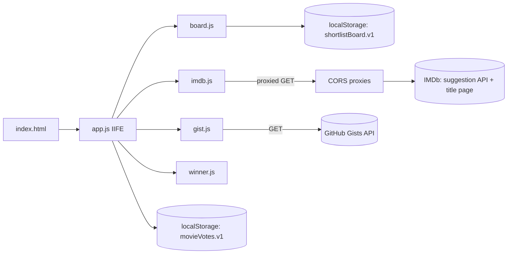
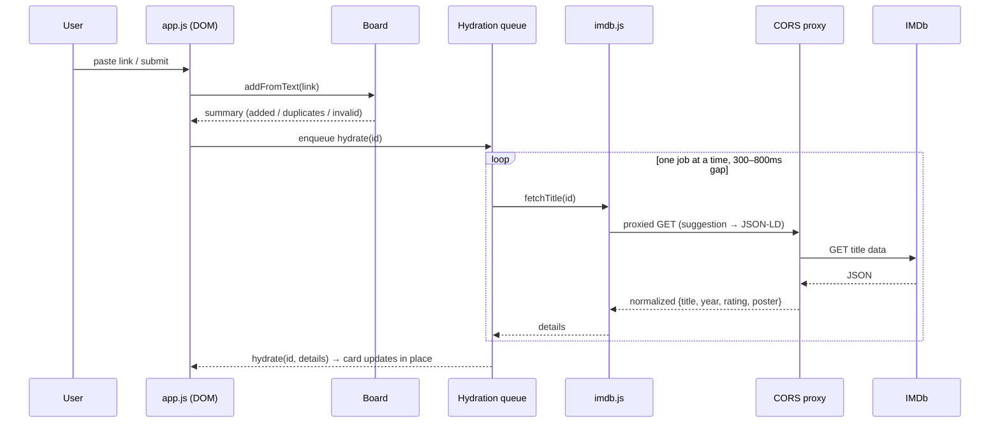
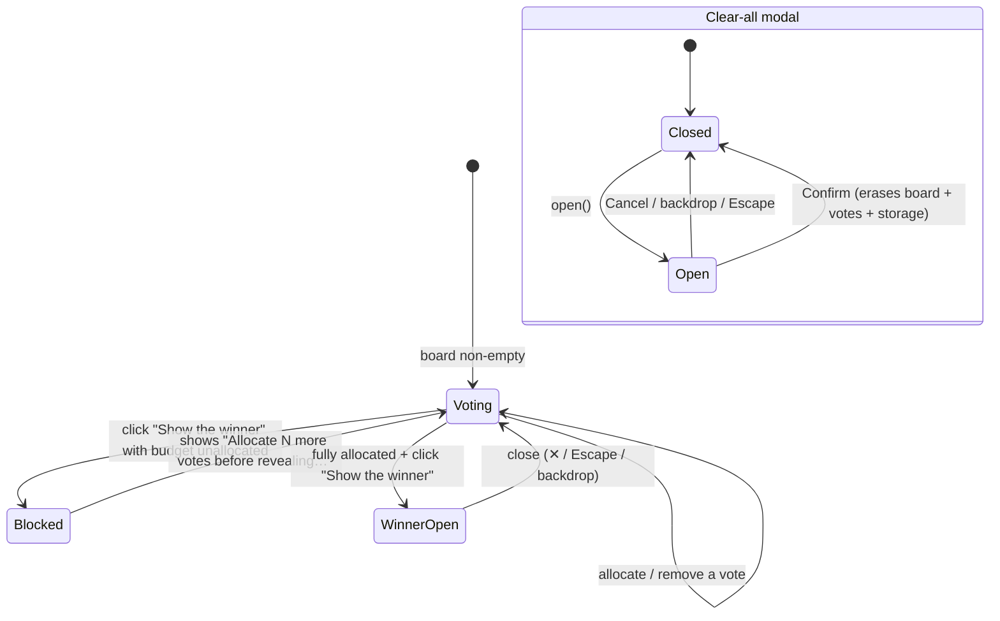

# The Shortlist

A single-page movie-night voting board. Paste IMDb links (or import a `.txt` /
GitHub gist of links), set a vote budget, cast your votes in private, then reveal
the winner on demand — no server, no accounts, everything in your browser.

Built as vanilla HTML/CSS/JS with a frosted dark-glass look. Movie metadata is
fetched live from IMDb through public CORS proxies; votes and the board persist
in `localStorage`.

## Quick start

This repo pins **pnpm** (`packageManager: pnpm@11.21.0` in `package.json`), so use
pnpm rather than npm/npx:

```bash
pnpm install
pnpm test          # runs the full Jest suite (ESM + jsdom)
```

To serve it locally, any static file server works, e.g.
`pnpm dlx serve .` — there is no build step.

## Project layout

```
.
├── index.html            # markup only; <head> loads the scripts, <body> is the app
├── styles.css            # the dark-glass design system (tokens + components)
├── app.js                # the controller (IIFE): DOM, state, voting, modals, reveal
├── board.js              # pure board state machine (no DOM) — UMD/globalThis
├── imdb.js               # link parsing + title metadata fetch/normalize — UMD
├── gist.js               # GitHub gist fetching — UMD
├── winner.js             # pure winner tally for the reveal modal — UMD
├── favicon.svg
├── DESIGN.md             # visual design system (tokens, type ramp, components)
├── tests/
│   ├── helpers/app-harness.js   # jsdom harness: loads the real index.html + app.js
│   └── *.test.js                # unit + integration suites
└── openspec/             # change proposals (spec-driven workflow)
```

The four `*js` modules are written as UMD-ish scripts that attach to
`globalThis` (so Jest can import them as ESM) and also work as classic
`<script>` tags in the browser. `app.js` is a plain IIFE that wires them to the
DOM.

## Architecture

### Module graph



### Add → hydrate data flow



The hydration queue runs with **concurrency 1** and a short randomized gap
between movies so a bulk import doesn't burst-rate the proxies.

### Voting, reveal gating, and modals



Movies are displayed in **insertion order** — votes never reorder the board,
which is what makes the reveal a genuine "call it when you're ready" moment.

## IMDb data pipeline

`imdb.js` fetches metadata through three providers, **first usable result wins**:

1. **Suggestion API** — `v3.sg.media-imdb.com/suggestion/x/{id}.json`. Lightest
   source; provides title / year / poster. **No rating** (renders `—`).
2. **Title-page JSON-LD** — `imdb.com/title/{id}/` embedded `ld+json`. Fallback
   used only to add the **rating**.
3. **api.imdbapi.dev** — legacy, now dead (kept last; instant DNS fail).

Each provider is reached through a chain of **CORS proxies** tried sequentially
(`api.allorigins.win` → `api.codetabs.com` → `test.cors.workers.dev`). A failed
attempt (429/408/5xx or network error) is retried with **capped exponential
backoff + jitter** (base 1500 ms, cap 6000 ms, 2 retries per proxy) before the
next proxy is tried. If every provider fails, the card degrades to a placeholder
(`Unavailable`) — never a crash or fabricated data.

| Setting | Value |
| --- | --- |
| Retries per proxy | 2 (3 attempts total) |
| Backoff base | 1500 ms (exponential) |
| Backoff cap | 6000 ms |
| Jitter | 0–500 ms |
| Hydration queue | concurrency 1, 300–800 ms gap |

## Storage schema

| Key | Shape | Purpose |
| --- | --- | --- |
| `shortlistBoard.v1` | `{ movies: [{ id, title, year, rating, posterUrl, status }] }` | the board (persisted after hydration) |
| `movieVotes.v1` | `{ budget: number, byId: { [movieId]: allocatedVotes } }` | vote budget + allocations |

Both are written on every mutation and reloaded on page open — so a refresh
restores the board with no re-fetch.

## Testing

Run the whole suite (or one file):

```bash
pnpm test                                   # all suites
node --experimental-vm-modules node_modules/jest/bin/jest.js sections.test.js
```

Jest runs as **ESM** (`"type": "module"`, `node --experimental-vm-modules`) with
the default `node` environment; the DOM suites opt into **jsdom** per file via a
`/** @jest-environment jsdom */` docblock and pull the `jest` object from
`@jest/globals` (ESM doesn't inject it as a global). Dev dependencies:
`jest`, `jest-environment-jsdom`, `jsdom`, `@jest/globals`.

### Test map

| Suite | Coverage |
| --- | --- |
| `fixture.test.js` | asserts the shipped DOM contract (required ids + sections) |
| `sections.test.js` | vote-budget stepper (clamp, trim-largest-on-shrink), add-by-link (add/duplicate/invalid/9-9), gist import triggers, status bar (count, feedback, Clear-all) |
| `modals.test.js` | clear-all (open/close/Escape/backdrop/focus-trap/focus-return/wipe) and winner reveal (disabled-empty, blocked-with-message, winner hero + ranked rows, tie→earliest, focus-return, fresh re-tally) |
| `cards.test.js` | insertion order, rank chips, remove, score badge, poster-fallback wiring, empty state, counter arc share, +/− disabled edges, aria-labels |
| `pipeline.integration.test.js` | add-by-link hydration (suggestion → JSON-LD fallback → all-fail error state), TXT multi-import (dedupe + full-board skip), gist success/failure paths, reload persistence |
| `imdb.test.js` / `board.test.js` / `gist.test.js` / `winner.test.js` / `integration.test.js` | the pure modules + a DOM-less pipeline simulation |

The UI suites load the **real `index.html`** and run the **real `app.js`** through
a small harness (`tests/helpers/app-harness.js`) — there is no copied fixture
markup to drift. Network is fully mocked (`fetch` is routed by the unwrapped IMDb
/ GitHub target), so the suite is **offline** and makes **zero real requests**.

> Note: the resilience ("all providers fail") path intentionally exercises the
> real backoff sleeps, so that one test is time-weighted by design.
