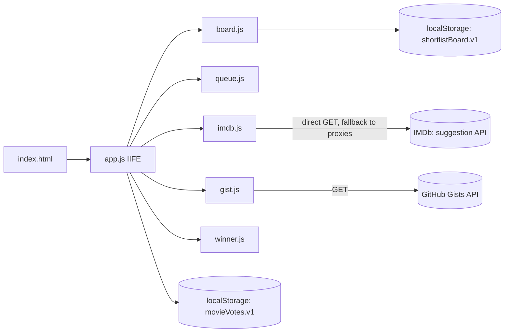
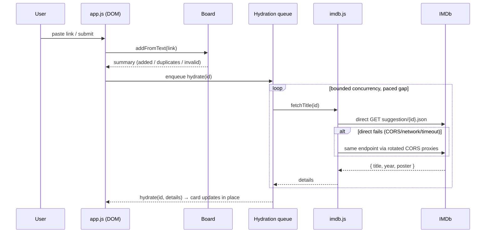

# The Shortlist

A single-page movie-night voting board. Paste IMDb links (or import a `.txt` /
GitHub gist of links), set a vote budget, cast your votes in private, then reveal
the winner on demand — no server, no accounts, everything in your browser.

Built as vanilla HTML/CSS/JS with a frosted dark-glass look. Movie metadata is
fetched live from IMDb — **directly from the browser first**, with the public
CORS proxies kept only as a fallback; votes and the board persist in
`localStorage`.

## Quick start

This repo use pnpm rather than npm/npx:

```bash
pnpm install

# runs the full Jest suite (ESM + jsdom)
pnpm test          
```

To serve it locally, any static file server works, e.g.
`pnpm dlx serve .` — there is no build step.

## Project layout

```
.
├── index.html            # markup only; <head> loads the scripts, <body> is the app
├── styles.css            # the dark-glass design system (tokens + components)
├── src/                  # business modules (classic <script> + ESM-under-test)
│   ├── app.js            # the controller (IIFE): DOM, state, voting, modals, reveal
│   ├── board.js          # pure board state machine (no DOM) — UMD/globalThis
│   ├── imdb.js           # link parsing + title metadata fetch/normalize — UMD
│   ├── queue.js          # bounded-concurrency hydration queue (dedup + cache)
│   ├── gist.js           # GitHub gist fetching — UMD
│   ├── winner.js         # pure winner tally for the reveal modal — UMD
│   ├── topbar.js         # navbar status model (count, missing votes) — UMD
│   └── toast.js          # transient corner feedback — UMD
├── favicon.svg
├── DESIGN.md             # visual design system (tokens, type ramp, components)
├── tests/
│   ├── helpers/app-harness.js   # jsdom harness: loads the real index.html + app.js
│   ├── unit/                    # pure-module suites (*.test.js)
│   ├── api/                     # imdb.api.test.js — fetch/CORS/rate-limit suite
│   ├── integration/             # DOM-less + DOM-through-app pipeline suites
│   └── ui/                      # jsdom suites (cards, sections, modals, fixture)
└── openspec/             # change proposals (spec-driven workflow)
```

The modules under `src/` are written as UMD-ish scripts that attach to
`globalThis` (so Jest can import them as ESM) and also work as classic
`<script>` tags in the browser. `src/app.js` is a plain IIFE that wires them to
the DOM.

## Architecture

### Module graph



### Add → hydrate data flow



The hydration queue runs with **bounded concurrency** (3 in flight) and a short
randomized gap (150–400 ms) between launches, so a bulk import never bursts the
network and — because the happy path is a single direct request — stays well
under any rate limit.


## IMDb data pipeline

`src/imdb.js` resolves each movie's details by fetching the IMDb **suggestion
API** directly from the browser first:

```
https://v3.sg.media-imdb.com/suggestion/x/{id}.json
```

The endpoint sends `Access-Control-Allow-Origin`, so the browser can call it
with no proxy at all — one request, typically under ~100 ms. Only if that direct
request fails (network error, blocked request, timeout, or an unusable body) does
the pipeline fall back to the same endpoint wrapped in a rotating chain of three
CORS proxies. 

The suggestion API carries **title, year, and poster — no rating**. The card
shows those three plus an IMDb link; no rating is fetched or displayed.


## Testing

Run the whole suite (or one file):

```bash
pnpm test

# all suites                                  
node --experimental-vm-modules node_modules/jest/bin/jest.js tests/ui/sections.test.js
```


### Test map

| Suite | Coverage |
| --- | --- |
| `tests/ui/fixture.test.js` | asserts the shipped DOM contract (required ids + sections) |
| `tests/ui/sections.test.js` | vote-budget stepper (clamp, trim-largest-on-shrink), add-by-link (add/duplicate/invalid/9-9), gist import triggers, status bar (count, feedback, Clear-all) |
| `tests/ui/modals.test.js` | clear-all (open/close/Escape/backdrop/focus-trap/focus-return/wipe) and winner reveal (disabled-empty, blocked-with-message, winner hero + ranked rows, tie→earliest, focus-return, fresh re-tally) |
| `tests/ui/cards.test.js` | insertion order, rank chips, remove, badge row (year + IMDb link, no rating), poster-fallback wiring, empty state, counter arc share, +/− disabled edges, aria-labels |
| `tests/integration/pipeline.integration.test.js` | add-by-link hydration (direct-first → proxy fallback → all-fail error state), TXT multi-import (dedupe + full-board skip), gist success/failure paths, reload persistence |
| `tests/api/imdb.api.test.js` | API contract, CORS posture, fetch transport, and rate-limit strategy over the injected-fetch harness |
| `tests/unit/imdb.test.js` / `tests/unit/board.test.js` / `tests/unit/gist.test.js` / `tests/unit/winner.test.js` / `tests/integration/integration.test.js` | the pure modules + a DOM-less pipeline simulation |

The UI suites load the **real `index.html`** and run the **real `src/app.js`**
through a small harness (`tests/helpers/app-harness.js`) — there is no copied
fixture markup to drift. Network is fully mocked (`fetch` is routed by the
unwrapped IMDb / GitHub target), so the suite is **offline** and makes **zero
real requests**.


